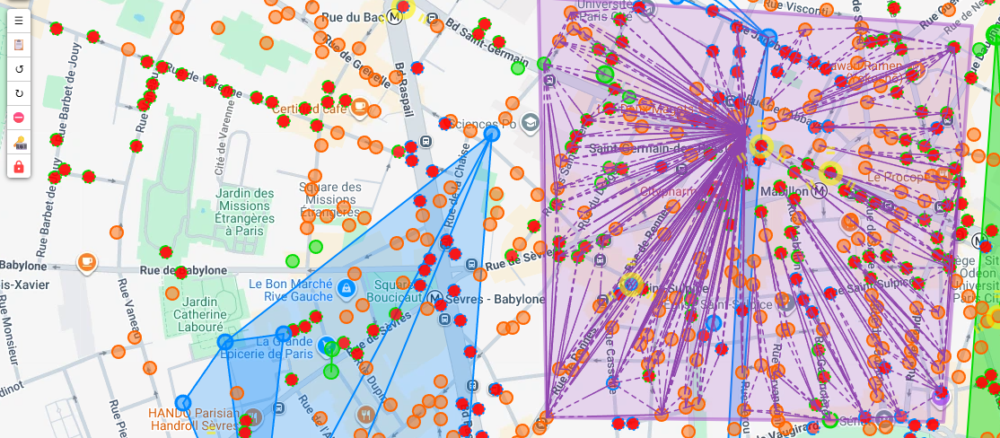
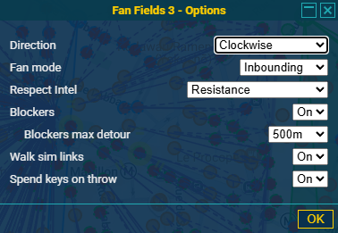
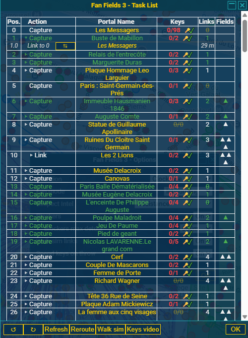
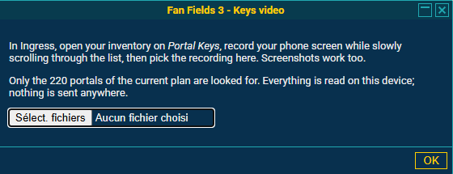

# Fan Fields 3
An INGRESS fan field planner plugin for IITC Desktop and Mobile.

Fan Fields 3 is a fork of [Heistergand's Fan Fields 2](https://github.com/Heistergand/fanfields2) — thanks Heistergand for the original work! On top of the original planner, it adds walking optimization, automatic best anchor/direction search, Blockers handling, plan locking, a Task List that follows your progress, Walk sim, Manage Ops and more — see the full list below.

Use this plugin to easily plan your fanfields. It tells you how many keys you need for each portal, shows the total amount of fields and calculates the AP you will gain just for the links and fields. Works also for star fields and classic multilayer. Does not estimate MU, sorry for that.

## Prerequisites
### Required
- [IITC CE](https://iitc.app) - Ingress Intel Total Conversion Community Edition
- IITC plugin: [Draw tools](https://iitc.app/download_desktop#draw-tools-by-breunigs) by breunings

### Supported
- IITC plugin: [Bookmarks for maps and portals](https://iitc.app/download_desktop#bookmarks-by-ZasoGD) by ZasoGD
- IITC plugin: Arc
- IITC plugin: [Keys](https://iitc.app/download_desktop#keys-by-xelio) by xelio
- IITC Plugin: [Live Inventory](https://github.com/IITC-CE/Community-plugins?tab=readme-ov-file#live-inventory-by-eisfrei---fork-by-danielondiordna) by EisFrei - fork by DanielOnDiordna
- IITC Plugin: [Portal Route](https://iitc.app/community_plugins#portal-route-by-MikeDiehn) by Mike Diehn

## Features
- Select portals in your area by drawing a polygon around them with DrawTools, or pick an existing portal as a fixed anchor directly on the map.
- Let the magic happen: A fanfield Plan will instantly be shown as overlay.
- Add more portals to your plan by just adding more polygons around them.
- Fine-tune the selection without redrawing: click the "No entry" shortcut on the map, then click portals to leave them out of the plan (or bring them back in).
- Automatic best anchor/direction search that reuses your faction's existing links, so the plan lines up with real progress.
- Toggle three layers:
  - Fanfield Links
  - Fanfield Fields
  - Fanfield Numbers _(Show statistics on each portal)_
- Show the list of portals (Task List)
  - in the order to visit them, correctly sequencing outbound plans and rebalancing links when one gets thrown the wrong way
  - with the amount of keys you need
  - with the keys you already have _(if the Keys plugin or LiveInventory is used and maintained)_
  - fill in the Keys plugin from a screen recording of your keys in Ingress _(Task List "Keys video" button)_, or have keys spent automatically from the Keys plugin as you throw links
  - count of outgoing links per portal
  - detailed link information:
    - link order
    - target portal name
    - link distance
  - Reroute the steps left from where you stand, or preview the whole walk with Walk sim
  - Print-friendly export
- Plan locking, so the plan stops moving while you pan, zoom or the map data refreshes.
- Manage Ops: save your current drawing (with its options and anchor) under a name, and reload, rename, update or delete it later.
- Handle blockers: links crossing the plan that Respect Intel does not avoid are drawn as red dotted lines, and the Task List gets Destroy stops, placed where they add the least walking (with a maximum detour setting), to free them in time.
- Plot a route along the portals in IITC with Portal Route
- Open the path along the portals in Google Maps.
- Tweak your plan:
  - Move the anchor portal along the hull of the area, or pick any portal of the plan directly on the map as anchor — hull or not.
  - Toggle the build order clockwise or anticlockwise.
  - Toggle the main direction of the fan links: inbounding or outbounding at the anchor portal?
    - Set how many SBUL you plan to use
  - Toggle the link direction indicator.
  - Show respect to the current intel and avoid throwing crosslinks. _(In some cases useful, in others not at all...)_
  - Toggle to use bookmarked portals only
  - Edit the portal visit order in a portal sequence editior.
  - View the straight-line route preview along the portal sequence.
- Gather Stats including Build AP and total walking distance. _(Currently only for links and fields, not for destroying, capturing or deploying resos and mods)_
- mobile support

## Contribute
Don't hesitate to send pull requests.

## Reviews
### Youtube review by Agent 57Cell
Don't miss this review by Michael Hartley:
https://www.youtube.com/watch?v=Z9TPlpnMYyI

 _Thank you, 57Cell for making awesome Ingress videos. This script wouldn't exist without your fanfields videos._

### Field report by Agent KonnTower
Agent [KonnTower](https://community.ingress.com/en/profile/KonnTower) wrote a report about his [exercise in maxfielding - ~244 fields from 89 portals](https://community.ingress.com/en/discussion/9791/an-exercise-in-maxfielding-244-fields-from-89-portals?)

_It took three years until I stumbled over this report. It made me really happy to find it._

## Tutorial Video 
english: https://youtu.be/jwn6p5xFGNY
german https://youtu.be/IFgYGUdHNcs

## Donations
 > [!NOTE]
 > The best way to show your appreciation is to write reviews about where you've used it and tell me about it.

 > [!IMPORTANT]
 > If you think this is great and you really like to donate something: I have all I need. But the world is not what it seems, so head out and **donate blood** in your area, register as a **bone marrow donor** or **donate money to other charities**. It will change lives.

## How it looks (on desktop)
### Overview

### Options

### Task List

### Use of Keys Plugin information
Fan Fields 3 integrates with the [Keys](https://iitc.app/download_desktop#keys-by-xelio) plugin (or [Live Inventory](https://github.com/IITC-CE/Community-plugins?tab=readme-ov-file#live-inventory-by-eisfrei---fork-by-danielondiordna)) two ways:
- **Keys video**: record your phone screen while scrolling through your keys in Ingress (or just take screenshots), pick the recording in this dialog, and the key counts for the plan's portals are read straight from it — on your device, nothing is sent anywhere — and written into the Keys plugin once you've checked them.
- **Spend keys on throw**: once your keys are known, throwing a link is detected from the live intel data and automatically spends one key for its destination portal from the Keys plugin, so your key counts stay accurate as you walk the plan without having to update them by hand.

---

## ⭐ Star History

<a href="https://www.star-history.com/#Avataar120/fanfields3&type=date&legend=top-left">
 <picture>
   <source media="(prefers-color-scheme: dark)" srcset="https://api.star-history.com/svg?repos=Avataar120/fanfields3&type=date&theme=dark&legend=top-left" />
   <source media="(prefers-color-scheme: light)" srcset="https://api.star-history.com/svg?repos=Avataar120/fanfields3&type=date&legend=top-left" />
   
 </picture>
</a>

---
